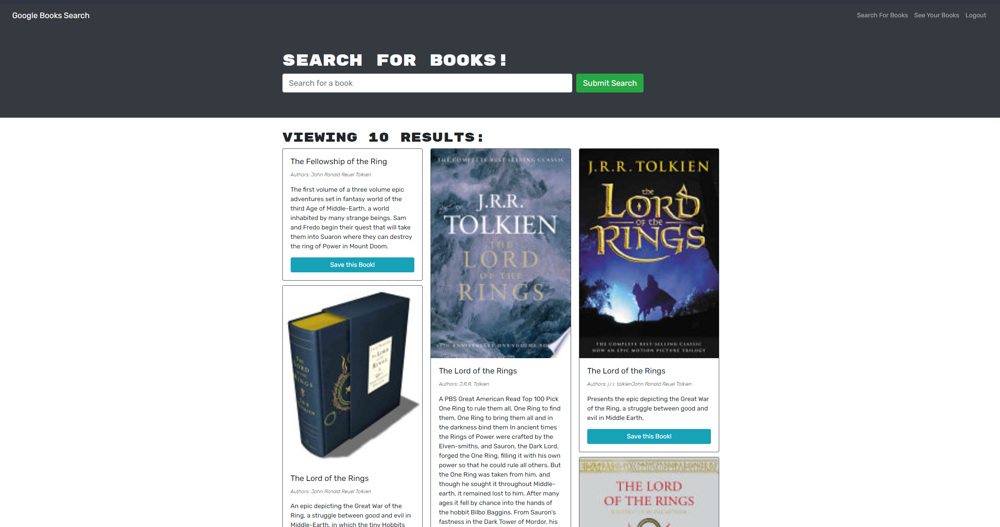

# Book Search Engine

## Description

This app was cerated for a bootcamp challenge. The goal was to refactor a functioning Google API Book Search Engine that uses RESTful API to use the GraphQl API with Apollo Server.

## Issues

- Upon loading saved books page after adding additional books the page will not show the newly added books and shows an error on page refresh. User must return to or reload the main application page after saving new books and before navigating to saved books page in order to avoid this issue.

## Link

[Deployed Application](https://warm-springs-73628.herokuapp.com/)
